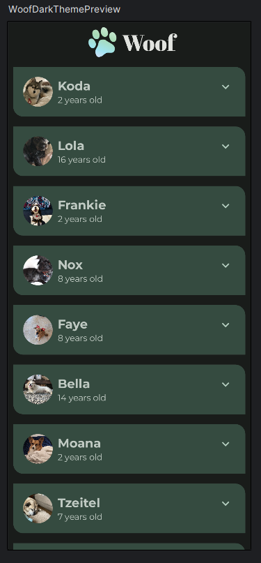
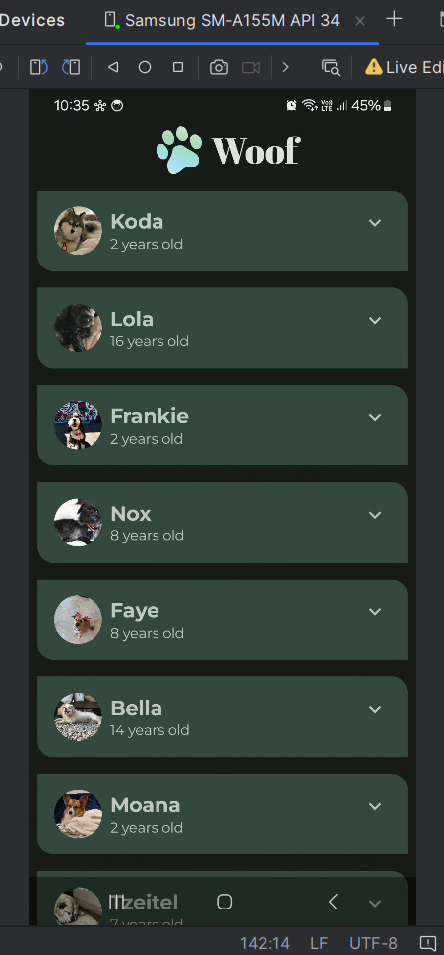

# CODELAB 9 - EJERCICIO 1: WOOF
### (Desarrollado con la guía Android Developers)

## Vista previa

## Ejecución en dispositivo físico

### Video de ejecución
[Ingresa aquí para ver el video](https://photos.app.goo.gl/mqiDf2r88rGpuxQd9)